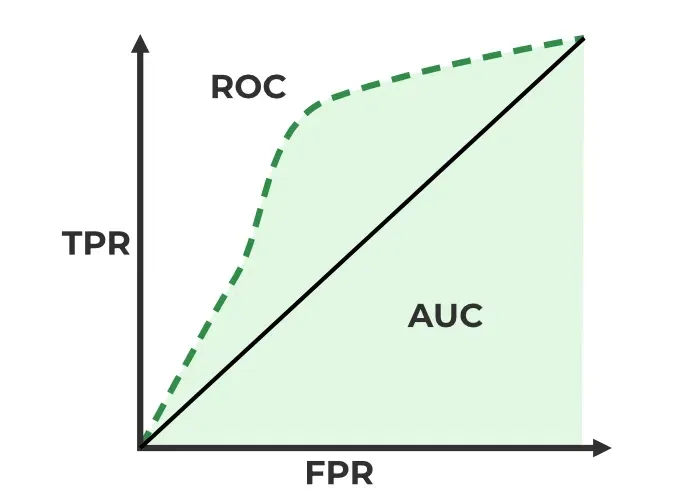

# Logistic Regression

## Assumption

-   Dependent variable is binary

-   Predictor variables must not have perfect multicollinearity

-   Large sample size

-   No influential outliers

## ETL

```{r}
# import .csv file into R
gc = read.csv('./Data/german_credit.csv')

# take a look at the structure of the data
str(gc)
```

From the structure, we can see that a lot of categorical data being read as integer. Next, we will pre-process the data before proceed with fit the data into training logistic regression model.

## Data Pre-processing

### Convert data type

```{r}
library(dplyr)

names(gc)[1] = 'cr'
table(gc$cr)/sum(table(gc$cr))
gc$cr = as.factor(gc$cr)

names(gc)[2] = 'acc.bal'
table(gc$acc.bal)/sum(table(gc$acc.bal))
# we wish to combine category 4 into 3
gc$acc.bal = replace(gc$acc.bal, gc$acc.bal == 4, 3)
gc$acc.bal = factor(gc$acc.bal, levels = seq(1:3), 
                       labels = c('No Acc', 'No Bal', 'Has Bal'))
table(gc$acc.bal)/sum(table(gc$acc.bal))

names(gc)[4] = 'pmt.stat.prev.cr'
table(gc$pmt.stat.prev.cr)/sum(table(gc$pmt.stat.prev.cr))
# we wish to combine category 1 into 0, and 4 into 3. Then shift downward
gc$pmt.stat.prev.cr[gc$pmt.stat.prev.cr <= 1] = 1
gc$pmt.stat.prev.cr[gc$pmt.stat.prev.cr == 2] = 2
gc$pmt.stat.prev.cr[gc$pmt.stat.prev.cr >= 3] = 3
table(gc$pmt.stat.prev.cr)/sum(table(gc$pmt.stat.prev.cr))
gc$pmt.stat.prev.cr = factor(gc$pmt.stat.prev.cr, levels = seq(1:3),
                             labels = c('Some probs', 'paid up', 'no prob'))

names(gc)[7] = 'savings.stocks'
table(gc$savings.stocks)/sum(table(gc$savings.stocks))
gc$savings.stocks[gc$savings.stocks == 4] = 3
gc$savings.stocks[gc$savings.stocks == 5] = 4
gc$savings.stocks = factor(gc$savings.stocks, levels = seq(1:4),
                           labels = c('none', '<100', '100-1000', '>1000'))
table(gc$savings.stocks)/sum(table(gc$savings.stocks))

names(gc)[8] = 'len.emp'
table(gc$len.emp)/sum(table(gc$len.emp))
gc$len.emp[gc$len.emp == 2] = 1
gc$len.emp[gc$len.emp == 3] = 2
gc$len.emp[gc$len.emp == 4] = 3
gc$len.emp[gc$len.emp == 5] = 4
gc$len.emp = factor(gc$len.emp, levels = seq(1:4), 
                    labels = c('< 1', '1-4', '4-7', '>7'))

table(gc$Occupation)/sum(table(gc$Occupation))
gc$Occupation[gc$Occupation == 2] = 1
gc$Occupation[gc$Occupation == 3] = 2
gc$Occupation[gc$Occupation == 4] = 3
gc$Occupation = factor(gc$Occupation, levels = seq(1:3), 
                       labels = c('unemp', 'skilled', 'exec'))

names(gc)[10] = 'sex'
table(gc$sex)/sum(table(gc$sex))
gc$sex[gc$sex == 2] = 1
gc$sex[gc$sex == 3] = 2
gc$sex[gc$sex == 4] = 3
gc$sex = factor(gc$sex, levels = seq(1:3), 
                labels = c('single male', 'married male', 'female'))

names(gc)[17] = 'cr.at.bank'
table(gc$cr.at.bank)/sum(table(gc$cr.at.bank))
gc$cr.at.bank[gc$cr.at.bank >= 2] = 2
gc$cr.at.bank = factor(gc$cr.at.bank, levels = seq(1:2),
                       labels = c('1', '>1'))

table(gc$Guarantors)/sum(table(gc$Guarantors))
gc$Guarantors[gc$Guarantors >= 2] = 2
gc$Guarantors = factor(gc$Guarantors, levels = seq(1:2), 
                       labels = c('no', 'yes'))

names(gc)[12] = 'dur.curr.add'
gc$dur.curr.add = as.factor(gc$dur.curr.add)

names(gc)[13] = 'most.val.asset'
gc$most.val.asset = as.factor(gc$most.val.asset)

table(gc$Concurrent.Credits)/sum(table(gc$Concurrent.Credits))
gc$Concurrent.Credits[gc$Concurrent.Credits <= 2] = 1
gc$Concurrent.Credits[gc$Concurrent.Credits == 3] = 2
gc$Concurrent.Credits = factor(gc$Concurrent.Credits, levels = seq(1:2),
                               labels = c('yes', 'no'))

names(gc)[16] = 'type.apartment'
gc$type.apartment = as.factor(gc$type.apartment)

table(gc$Purpose)/sum(table(gc$Purpose))*100
gc$Purpose[gc$Purpose == 0] = 11
gc$Purpose[gc$Purpose %in% c(3, 4, 5, 6)] = 3
gc$Purpose[gc$Purpose %in% c(8, 9, 10, 11)] = 4
gc$Purpose = factor(gc$Purpose, levels = seq(1:4), 
                    labels = c('new car', 'used car', 'house', 'other'))

names(gc)[9] = 'installment'
gc$installment = as.factor(gc$installment)

names(gc)[19] = 'no.dependent'
gc$no.dependent = as.factor(gc$no.dependent)

names(gc)[20] = 'tel'
gc$tel = as.factor(gc$tel)

names(gc)[21] = 'foreign.worker'
gc$foreign.worker = as.factor(gc$foreign.worker)
```

```{r}
library(gmodels)

CrossTable(gc$cr,gc$acc.bal, digits = 3, prop.r = F, prop.t = F,
           prop.chisq = F, chisq = T)

CrossTable(gc$cr,gc$pmt.stat.prev.cr, digits = 3, prop.r = F, prop.t = F,
           prop.chisq = F, chisq = T)

CrossTable(gc$cr,gc$savings.stocks, digits = 3, prop.r = F, prop.t = F,
           prop.chisq = F, chisq = T)

CrossTable(gc$cr,gc$len.emp, digits = 3, prop.r = F, prop.t = F,
           prop.chisq = F, chisq = T)

CrossTable(gc$cr,gc$sex, digits = 3, prop.r = F, prop.t = F,
           prop.chisq = F, chisq = T)

CrossTable(gc$cr,gc$cr.at.bank, digits = 3, prop.r = F, prop.t = F,
           prop.chisq = F, chisq = T)

CrossTable(gc$cr,gc$Guarantors, digits = 3, prop.r = F, prop.t = F,
           prop.chisq = F, chisq = T)

CrossTable(gc$cr,gc$Concurrent.Credits, digits = 3, prop.r = F, prop.t = F,
           prop.chisq = F, chisq = T)

CrossTable(gc$cr,gc$type.apartment, digits = 3, prop.r = F, prop.t = F,
           prop.chisq = F, chisq = T)

CrossTable(gc$cr,gc$no.dependent, digits = 3, prop.r = F, prop.t = F,
           prop.chisq = F, chisq = T)

CrossTable(gc$cr,gc$Purpose, digits = 3, prop.r = F, prop.t = F,
           prop.chisq = F, chisq = T)

CrossTable(gc$cr,gc$installment, digits = 3, prop.r = F, prop.t = F,
           prop.chisq = F, chisq = T)

# alternative ways
table(gc$acc.bal)/sum(table(gc$acc.bal))

margin.table(prop.table(table(gc$installment)),1)
```

```{r}
str(gc)
```

```{r}
summary(gc$Duration.of.Credit..month.)
summary(gc$Credit.Amount)
summary(gc$Age..years.)

par(mfrow=c(1,3))
hist(gc$Duration.of.Credit..month., breaks = 6, xlab = 'Credit Month')
hist(gc$Credit.Amount, breaks = 20, xlab = 'Credit Amount')
hist(gc$Age..years., xlab = 'Age')

boxplot(gc$Duration.of.Credit..month., xlab = 'Credit Month', asp = 1)
boxplot(gc$Credit.Amount, xlab = 'Credit Amount', asp = 1)
boxplot(gc$Age..years., xlab = 'Age', asp = 1)
```

## Statistical testing

```{r}
cat.table = data.frame(var = character(), p.value = numeric())

for (i in names(gc[, c('acc.bal', "pmt.stat.prev.cr", "Purpose", "savings.stocks",
                       "len.emp", "installment", "sex", "dur.curr.add",
                       "type.apartment", "most.val.asset", "cr.at.bank",
                       "Guarantors", "Occupation", "Concurrent.Credits",
                       "no.dependent", "tel")])) {
  p.value = round(chisq.test(gc$cr, gc[, i])$p.value, 2)
  df = data.frame(var = i, p.value)
  cat.table = rbind(cat.table, df)
}

cat.table

t.tst
```

## Data Pre-processing

-   Feature Engineering: Create new relevant features from existing data (e.g., extracting time-based features from a time stamp)

-   Feature scaling: Standardize or normalize to ensure numerical stability

-   Feature selection: Remove irrelevant feature or correlated feature

## Model Training

-   Select appropriate ML algorithm

-   Split data into test/train

-   Train the model

```{r}
# split data into train and test
indexes = sample(1:nrow(gc), size = 0.5 * nrow(gc))
# sample from dataset of a seq of number 1 to 1000 and take 500 sample dataset from it

train = gc[indexes, ]
test = gc[-indexes, ]
# this step wont carry the data type of the previous data, you'll need to re-convert tha data type into factor where necessary
```

generalized linear model = glm()

-   when y is binary

H~0~ : B~j~ = 0

H~1~ : B~j~ a ≠ b

```{r}
model = glm(cr~acc.bal+pmt.stat.prev.cr+Purpose+savings.stocks+len.emp+sex+
              most.val.asset+Concurrent.Credits+type.apartment+
              Duration.of.Credit..month.+Credit.Amount+Age..years., 
            family=binomial, data=train)

summary(model)

model1 = glm(cr~acc.bal+pmt.stat.prev.cr+Purpose+savings.stocks+len.emp+sex+
              most.val.asset+Concurrent.Credits+type.apartment+
              Duration.of.Credit..month.+Credit.Amount+Age..years., 
            family=binomial, data=train)


summary(model1)

model2 = glm(cr~acc.bal+pmt.stat.prev.cr+Purpose+len.emp+sex, 
            family=binomial, data=train)


summary(model2)
```

Remove non-significant variable, repeat this step until all variables in the model are significant

## Model Evaluation

```{r}
fit = fitted.values(model1)

# setting threshold
t = rep(0,500)
for (i in 1:500) {
  if (fit[i] >= 0.5) {
    t[i] = 1
  } 
}

# create cross table
conf.mat = table(t, train$cr)
conf.mat

CrossTable(train$cr,t, digits = 3, prop.r = F, prop.c = F, prop.chisq = F)

sum(diag(conf.mat))/500 * 100


```

```{r}
library(ROCR)

pred = prediction(model1$fitted.values, train$cr)
perf = performance(pred, 'tpr', 'fpr')
plot(perf)
```

## Model testing

```{r}
pred_test = predict(model1, data = test, type = 'response')

t_test = rep(0,500)
for (i in 1:500) {
  if (pred_test[i] > 0.5) {
    t_test[i] = 1
  } else {
    t_test[i] = 0
  }
}

str(t_test)

CrossTable(test$cr, t_test, digits = 1, prop.t = F, prop.r = F, prop.chisq = F,
           chisq = F)

conf.mt.test = table(test$cr, t_test)
sum(diag(conf.mt.test))/500 * 100
```

```{r}
pred_test = prediction(pred_test, test$cr)
perf_test = performance(pred_test, 'tpr', 'fpr')
plot(perf_test)
pred_test
```

# Tree Based Method

## Model Training

```{r}
library(tree)
set.seed(30)
model_tree = tree(cr~acc.bal+pmt.stat.prev.cr+Purpose+savings.stocks+len.emp+sex+
              most.val.asset+Concurrent.Credits+type.apartment+
              Duration.of.Credit..month.+Credit.Amount+Age..years., 
            method='class', data=train)
```

```{r}
plot(model_tree)
text(model_tree, cex = 0.6)
```

## Model Evaluation

Evaluate train set <!--# kenapa predict 2 kali (page 13) -->

```{r}
train_pred = predict(model_tree, train, type='class')
ct1 = table(train$cr, train_pred)
sum(diag(ct1))/500*100

fit_tree_train = predict(model_tree, data = train)

train_pred = prediction(fit_tree_train[,2], train$cr)
train_perf = performance(train_pred, 'tpr', 'fpr')
plot(train_perf)
```

lebih jauj

Evaluate test set <!--# kenapa line tak straight -->

```{r}
test_pred = predict(model_tree, data = test)
prod_pred = prediction(test_pred[,2], test$cr)
test_perf = performance(prod_pred, 'tpr', 'fpr')
plot(test_perf)
```

AUC-ROC curve

Used for evaluating binary classification model. Plots **True Positive Rate (TPR) VS False Positive Rate (FPR)** at different threshold

-   TPR : ratio of correctly predicted positive instances

-   FPR : ratio of wrongly predicted positive instances

-   AUC : Area Under the Curve

-   ROC : Receiver Operating Characteristic Curve



Pruning <!--# how to determine best = 8 -->

```{r}
model_tree_prune = prune.misclass(model_tree, best = 8)
```

Evaluate train set

```{r}
prune_train = predict(model_tree_prune, data = train)
prune_train_pred = prediction(prune_train[,2], train$cr)
prune_train_perf = performance(prune_train_pred, 'tpr', 'fpr')
plot(prune_train_perf)
```

Evaluate test set

```{r}
prune_test = predict(model_tree_prune, data = test)
prune_test_pred = prediction(prune_test[,2], test$cr)
prune_test_perf = performance(prune_test_pred, 'tpr', 'fpr')
plot(prune_test_perf)
```
